# ARGUS Entity-Relationship Diagram

- **Document version:** 0.6.0 (Slice 2D coverage added: the Hypothesis family and boundary-owned validity links)
- **Derived from:** [Domain Schema Specification](../domain/DOMAIN_SCHEMA_SPECIFICATION.md) 1.1.0, [Entity Lifecycles](../domain/ENTITY_LIFECYCLES.md) 2.0.0, ADR-0007

## Slice 1 — Constitutional Evidence Activation

```mermaid
erDiagram
    CASE ||--o{ EVIDENCE_ARTIFACT : "scopes"
    CASE ||--o{ AUDIT_ENTRY : "scopes"
    CASE ||--o{ CASE_AUTHORITY : "grounded by (append-only)"
    EVIDENCE_ARTIFACT ||--o{ AUDIT_ENTRY : "target of"
    EVIDENCE_ARTIFACT ||--o{ SOURCE_LOCATOR : "scoped by (ACTIVE only at creation)"
    SOURCE_LOCATOR ||--o{ OBSERVATION_GROUNDING : "supports"
    OBSERVATION ||--|{ OBSERVATION_GROUNDING : "grounded by (>= 1)"
    CASE ||--o{ OBSERVATION : "scopes"
    OBSERVATION ||--o{ INTERPRETATION_GROUNDING : "relied upon by (snapshot)"
    INTERPRETATION ||--|{ INTERPRETATION_GROUNDING : "grounded by (>= 1)"
    CASE ||--o{ INTERPRETATION : "scopes"
    CASE ||--o{ UNKNOWN : "scopes"
    UNKNOWN ||--o{ UNKNOWN_LINK : "bounds (validity family, ONT-PRN-021)"
    UNKNOWN ||--o| UNKNOWN_RESOLUTION : "disposed by (human-only, terminal)"
    CASE ||--o{ CONTRADICTION : "scopes"
    CONTRADICTION ||--|{ CONTRADICTION_MEMBER : "binds (>= 2 INCOMPATIBLE_CLAIMs, snapshots)"
    CONTRADICTION ||--o| CONTRADICTION_DISPOSITION : "disposed by (human-only, non-adjudicating)"
    CASE ||--o{ HYPOTHESIS : "scopes"
    INTERPRETATION ||--o{ HYPOTHESIS_GROUNDING : "relied upon by (snapshot, fingerprint v2)"
    HYPOTHESIS ||--|{ HYPOTHESIS_GROUNDING : "grounded by (>= 1 DERIVED_FROM)"
    HYPOTHESIS ||--o{ HYPOTHESIS_ALTERNATIVE : "articulated alternative (symmetric, non-ranking)"
    UNKNOWN ||--o{ UNKNOWN_LINK : "bounds Hypothesis too (LIMITED_BY_UNKNOWN)"
    CONTRADICTION ||--o{ CONTRADICTION_LINK : "challenges (CHALLENGED_BY_CONTRADICTION, never kills)"
    HYPOTHESIS ||--o{ CONTRADICTION_LINK : "challenged by (boundary-owned)"

    HYPOTHESIS {
        string id PK
        string case_id FK
        string citation "HYP-NNNNNN"
        string explanatory_statement "admissible for examination - never likely, preferred, correct, or accepted (ONT-PRN-023)"
        string reasoning_description "required (Article III)"
        string uncertainty_status "ACKNOWLEDGED | MATERIAL | LIMITING | UNRESOLVED"
        string uncertainty_explanation "required (Article IX)"
        string testability_statement "what future evidence would matter (Article VII)"
        string challenge_condition "declaration, not prediction"
        string alternative_articulation_at_creation "ALTERNATIVE_LINKED_AT_CREATION | NONE_CURRENTLY_ARTICULATED_AT_CREATION (immutable historical truth)"
        string alternative_absence_explanation "required iff none articulated at creation; never erased by later links"
        string no_current_unknowns_explanation "nullable; XOR with LIMITED_BY_UNKNOWN links at creation"
        string no_current_contradictions_explanation "nullable; XOR with CHALLENGED_BY_CONTRADICTION links at creation"
        string created_by "HUMAN only (AI authorship NOT AUTHORIZED)"
        datetime created_at
        datetime retracted_at "nullable (class V); siblings unaffected, no promotion"
        string retraction_reason
    }
    HYPOTHESIS_GROUNDING {
        string id PK
        string hypothesis_id FK
        string interpretation_id FK "rung-skips unrepresentable (FK)"
        string interpretation_fingerprint "fingerprint v2: sha256 over 4 fields, 0x1F-separated"
        string grounding_role "DERIVED_FROM | CONTEXTUALIZED_BY (only DERIVED_FROM satisfies the minimum)"
        datetime linked_at "CI rows; survive all retractions"
    }
    HYPOTHESIS_ALTERNATIVE {
        string id PK
        string hypothesis_a_id FK "normalized: a < b (unordered pair)"
        string hypothesis_b_id FK
        string relation_explanation "required; no comparative-strength language"
        string linked_by "HUMAN only"
        datetime linked_at "CI; survives either side's retraction"
    }
    CONTRADICTION_LINK {
        string id PK
        string contradiction_id FK
        string hypothesis_id FK "same case"
        string hypothesis_fingerprint "fingerprint v1: sha256 over 6 fields, 0x1F-separated"
        string relationship_type "CHALLENGED_BY_CONTRADICTION only - no refuted/disproven/defeated/weakened/invalidated, ever"
        string explanation "required; how the incompatibility bears on the explanation"
        string linked_by "HUMAN only"
        datetime linked_at
        datetime retracted_at "nullable (class V, link errors only - never silent removal)"
        string retraction_reason
    }

    CONTRADICTION {
        string id PK
        string case_id FK
        string citation "CON-NNNNNN"
        string description
        string contradiction_type "TEMPORAL|SPATIAL|IDENTITY|CAUSAL|DESCRIPTIVE|NUMERIC|PROCEDURAL|PROVENANCE|CUSTODY|LOGICAL"
        string scope_definition "shared conditions under which claims conflict"
        string incompatibility_basis "why simultaneous truth is impossible"
        string operational_state "OPEN | UNDER_REVIEW"
        string created_by "HUMAN only in Slice 2C"
        datetime created_at
    }
    CONTRADICTION_MEMBER {
        string id PK
        string contradiction_id FK
        string member_type "Observation | Interpretation"
        string member_id "same case; CI, survives everything"
        string member_fingerprint "sha256 of statement/meaning at recognition"
        string member_role "INCOMPATIBLE_CLAIM (no directional roles, ever)"
        datetime linked_at
    }
    CONTRADICTION_DISPOSITION {
        string id PK
        string contradiction_id FK "unique: at most one"
        string outcome "EXPLAINED|NO_LONGER_APPLICABLE|WITHDRAWN|UNRESOLVED|SUPERSEDED"
        string rationale "required; never names a survivor"
        json   informing_refs "nullable; informs, never vindicates"
        string disposed_by "HUMAN only"
        datetime created_at "CI; terminal"
    }

    UNKNOWN {
        string id PK
        string case_id FK
        string citation "UNK-NNNNNN"
        string question "interrogative form; anti-TODO guard (ONT-PRN-020)"
        string impact_statement "nullable"
        string operational_state "OPEN | UNDER_REVIEW (CT; no conclusion)"
        string created_by "HUMAN only in Slice 2B"
        datetime created_at
    }
    UNKNOWN_LINK {
        string id PK
        string unknown_id FK
        string target_type "Observation | Interpretation | EvidenceArtifact | Hypothesis"
        string target_id "same case; boundary, never grounds"
        string nature "how the gap bounds the target"
        datetime linked_at
        datetime retracted_at "nullable (class V)"
        string retraction_reason
    }
    UNKNOWN_RESOLUTION {
        string id PK
        string unknown_id FK "unique: at most one"
        string resolution_type "ANSWERED | PARTIALLY_ANSWERED | UNRESOLVABLE | WITHDRAWN"
        string rationale "required"
        json   answering_claims "required for (PARTIALLY_)ANSWERED"
        string resolved_by "HUMAN only"
        datetime created_at "CI; terminal"
    }

    INTERPRETATION {
        string id PK
        string case_id FK
        string citation "INT-NNNNNN, unique per case; order non-evidentiary"
        string meaning_statement "no comparative-strength claims (lexical guard)"
        string reasoning_description "required (Article III)"
        string uncertainty_status "ACKNOWLEDGED | MATERIAL | LIMITING | UNRESOLVED"
        string uncertainty_explanation "required; not a confidence scale (Article IX)"
        string created_by "HUMAN only in Slice 2A"
        datetime created_at
        datetime retracted_at "nullable (class V); siblings unaffected"
        string retraction_reason
    }
    INTERPRETATION_GROUNDING {
        string id PK
        string interpretation_id FK
        string observation_id FK
        string statement_fingerprint "sha256 of the statement relied upon (revision snapshot)"
        string grounding_role "SUPPORTING | LIMITING | CONTEXTUAL"
        datetime linked_at "CI rows; survive all retractions"
    }

    SOURCE_LOCATOR {
        string id PK
        string case_id FK
        string artifact_id FK "target must be ACTIVE at creation"
        string scheme "byte-range | time-range | page-region (v0.1)"
        json   payload "scope of constitutional support (ONT-PRN-016)"
        string created_by
        datetime created_at
        datetime retracted_at "nullable (class V)"
        string retraction_reason
    }
    OBSERVATION {
        string id PK
        string case_id FK
        string citation "OBS-NNNNNN, unique per case"
        string statement "perception only; no meaning fields exist"
        string method_description "required (ONT-PRN-005)"
        datetime event_time_start "nullable; event time != record time (C4)"
        datetime event_time_end "nullable"
        string created_by "HUMAN only in Slice 1D"
        datetime created_at
        datetime retracted_at "nullable (class V)"
        string retraction_reason
    }
    OBSERVATION_GROUNDING {
        string id PK
        string observation_id FK
        string locator_id FK "unique (observation, locator)"
        datetime created_at "CI rows"
    }

    CASE {
        string id PK "opaque, never reused (C2)"
        string title
        string status "OPEN | SUSPENDED | CLOSED"
        string responsible_actor
        datetime created_at
    }
    CASE_AUTHORITY {
        string id PK
        string case_id FK
        string basis "warrant / statute / assignment"
        string recorded_by "HumanActor"
        datetime created_at "append-only; supersedes prior"
    }
    EVIDENCE_ARTIFACT {
        string id PK "opaque; identity also anchored by hash"
        string case_id FK "NOT NULL (C3)"
        string status "PENDING_VERIFICATION | ACTIVE | QUARANTINED | RETRACTED | SEALED"
        string hash_algorithm "sha-256 initial; additive only"
        string hash_digest "content-immutable forever"
        int    size_bytes "CI"
        string media_type "CI"
        string acquisition_description "CI (ONT-PRN-005)"
        string storage_ref "CT: non-authoritative pointer"
        string ingested_by "actor class + id"
        string human_authority "attributed HumanActor"
        datetime created_at
        datetime retracted_at "nullable; retraction pattern C6"
        string retraction_reason
        string superseded_by FK "nullable, self-reference"
    }
    AUDIT_ENTRY {
        string id PK
        string case_id FK "NOT NULL"
        int    seq "monotonic per case; unique(case_id, seq)"
        string actor_class "HUMAN | AI | SYSTEM"
        string actor_id
        string ai_model_version "nullable; required for AI actors"
        string action "from Lifecycles audit-event registry"
        string target_type
        string target_id
        string outcome "SUCCEEDED | REJECTED"
        string detail "structured payload (reason, transition)"
        datetime occurred_at
    }
```

Notes:

- `STAGED` does not appear: staging is pre-constitutional (ADR-0007 §2) and tracked by ingestion session outside the domain schema; only `PENDING_VERIFICATION` onward exists as a record.
- `AUDIT_ENTRY` has no update/delete path for any role; corrections are compensating entries (ONT-AUD-001).
- SourceLocator, the ladder claims, negative-space objects, Entity/Relationship arrive with Slices 2–4.

## Version history

| Version | Date | Change |
|---|---|---|
| 0.1.0 | 2026-07-13 | Slice 1 coverage: Case (+ append-only authority), EvidenceArtifact with the ADR-0007 explicit lifecycle, AuditEntry with per-case ordering. |
| 0.2.0 | 2026-07-13 | Slice 1D gate: SourceLocator (scope of constitutional support), Observation (first epistemic object, no meaning fields), groundings junction (heterogeneous evidence ready). |
| 0.3.0 | 2026-07-13 | Slice 2A gate: Interpretation (uncertainty envelope, no preference surface) and grounding snapshots (fingerprint + role + linked_at). |
| 0.4.0 | 2026-07-13 | Slice 2B gate: Unknown (operational vs. epistemic state), UnknownLink (validity-boundary family), UnknownResolution (human-only, evidence-requiring). |
| 0.5.0 | 2026-07-13 | Slice 2C gate: Contradiction (typed, scoped, based), members as snapshot-bearing INCOMPATIBLE_CLAIMs, non-adjudicating disposition (ADR-0027). |
| 0.6.0 | 2026-07-13 | Slice 2D gate: Hypothesis (four conditions, creation-time articulation, derived states), grounding snapshots (fingerprint v2), symmetric HypothesisAlternative, boundary-owned ContradictionLink, UnknownLink target extension (ADR-0028, Session 012). |
